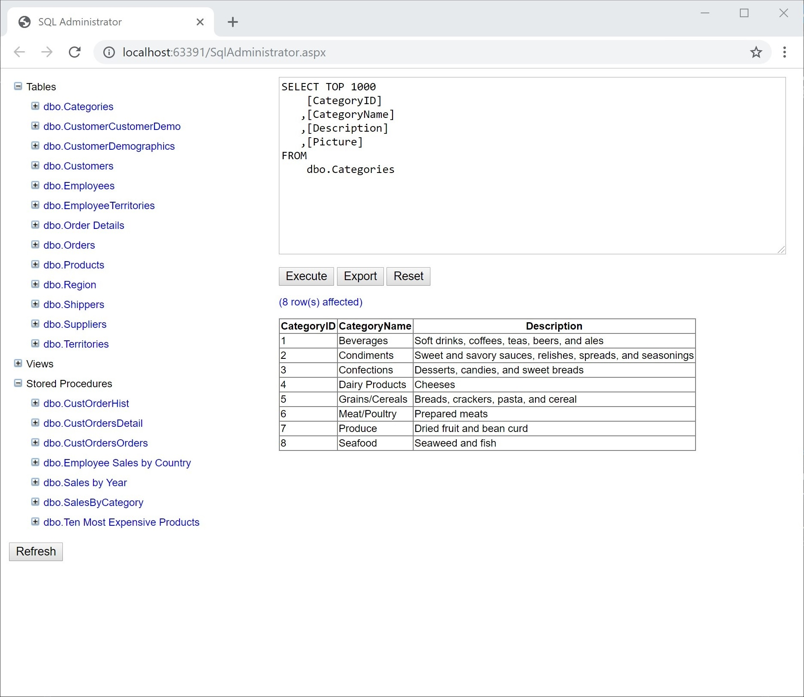

# SQL Administrator

SQL Administrator is a single file SQL administrator tool built using ASP.NET Web Forms.



## Instructions

Edit `SqlAdministrator.aspx` line 12 to reference the named connection string you want to use.

```csharp
private readonly string _connectionString = WebConfigurationManager.ConnectionStrings["ConnectionString"].ConnectionString;
```

Edit your `Web.config` file to secure the `SqlAdministrator.aspx` file:

```xml
<location path="SqlAdministrator.aspx">
<system.web>
    <authorization>
    <deny users="?"/>
    </authorization>
</system.web>
</location>
```

Finally drop the `SqlAdministrator.aspx` in the root of your web app.